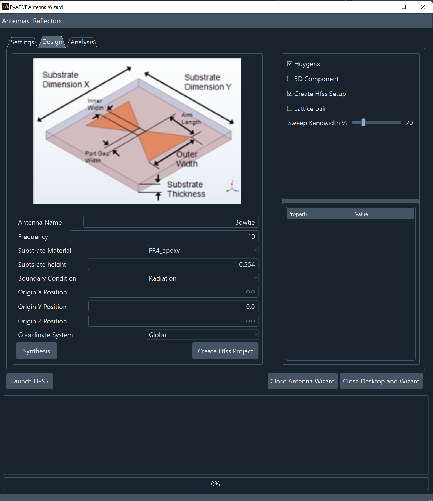
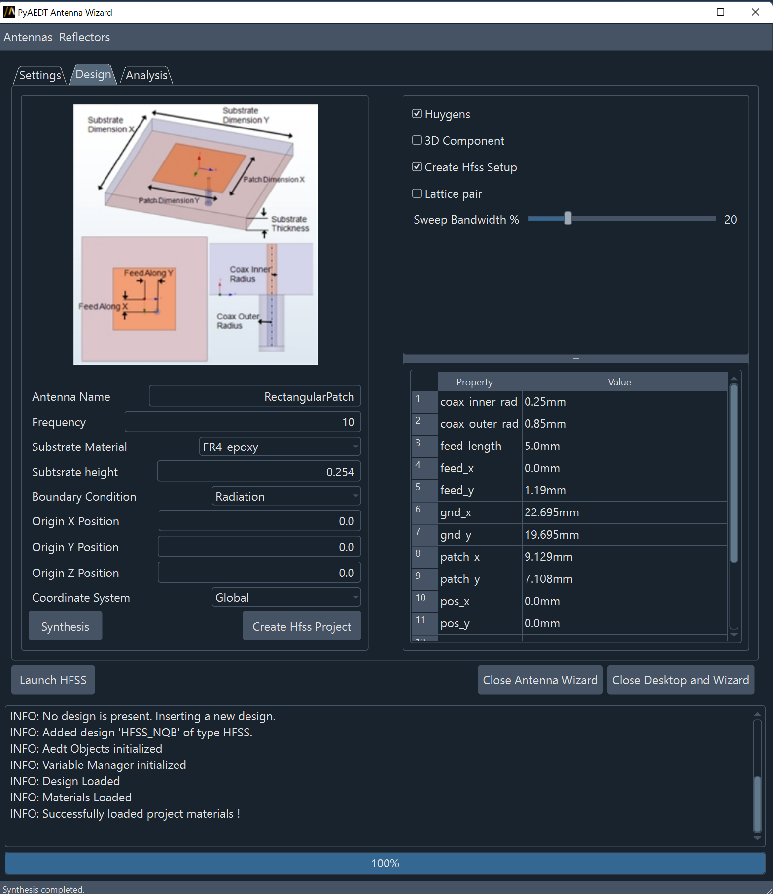
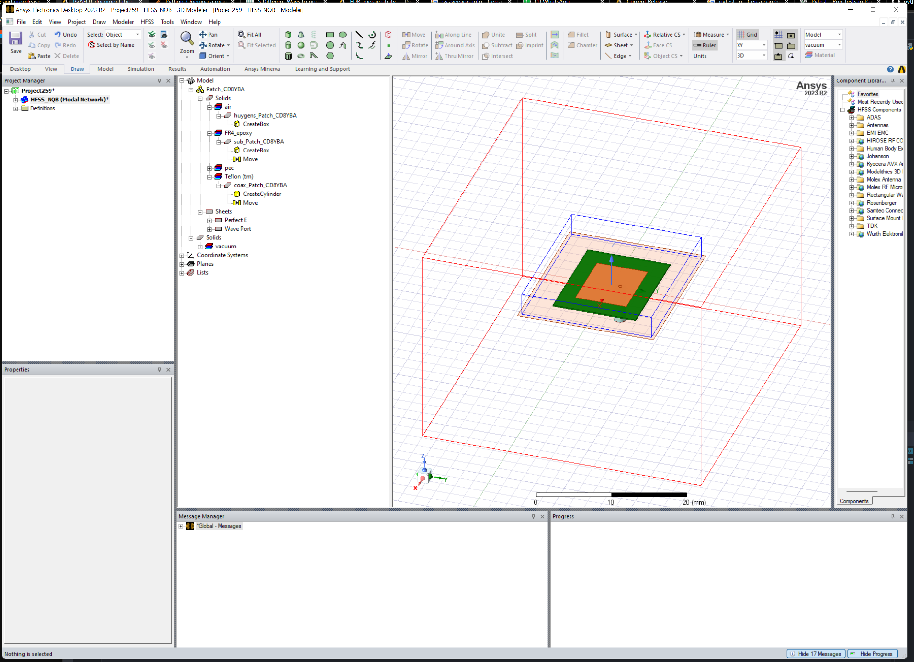
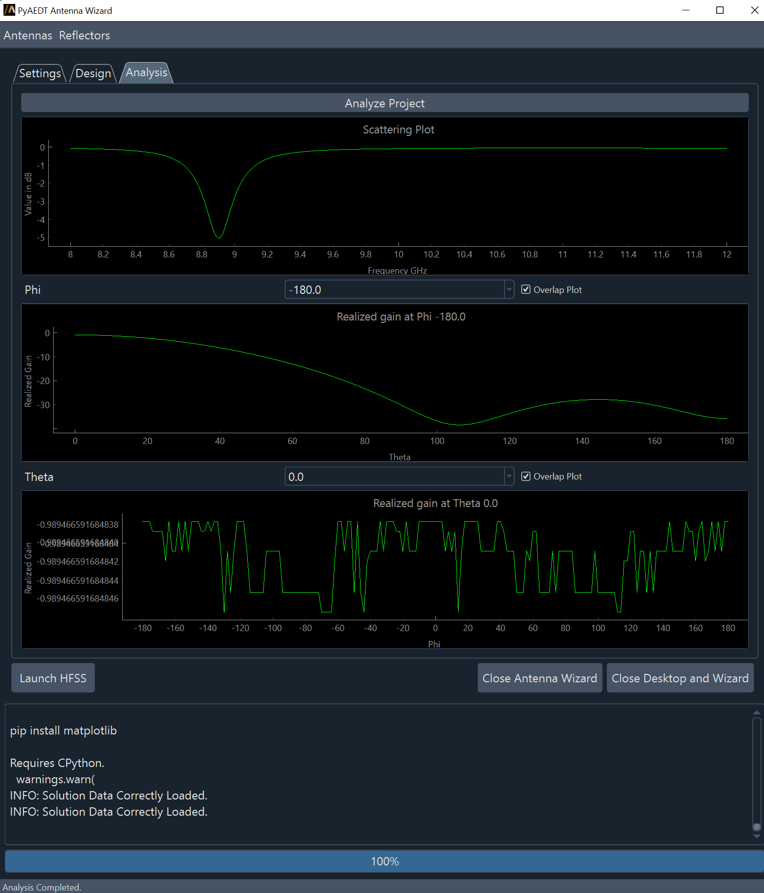

========================
Antenna wizard reference
========================

This section describes user interface available in AEDT's **Antenna Wizard**.
To run **Antenna Wizard**, you must have a licensed copy of Ansys Electronics
Desktop (AEDT) installed.

Once **Antenna Wizard** is launched user can choose settings from first page and connect to an existing
Electronics Desktop session or create a new session.

.. image:: ../Resources/antenna_toolkit_p1.png
  :width: 800
  :alt: Antenna Toolkit UI, Settings Tab

After Electronics Desktop is launched, user can move to design tab and select one antenna from the menu.

Once the antenna is loaded the user can click in the synthesis button and generate the antenna parameters

User can then click the Generate button and create the antenna in Electronics Desktop.

Moving to Analysis Tab, user can click Analyze Project button. AEDT project is saved, closed and solved.
At the end of the simulation, results are loaded in UI.

User can now iterate by changing some of the parameters in the Design tab and click Analyze Project button again.
Results are overlapped.
