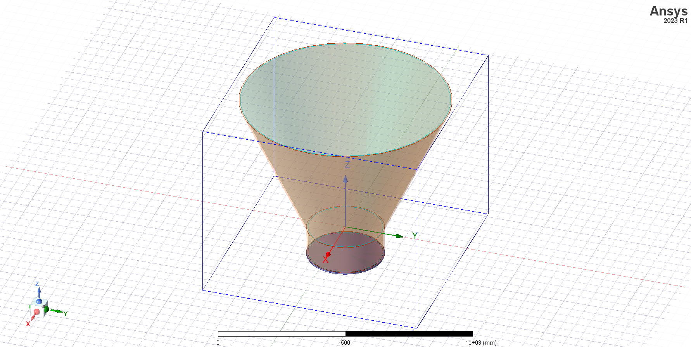

===============
Getting started
===============

To run this toolkit, you must have a licensed copy of Ansys Electronics Desktop (AEDT) installed.

The toolkit could be used inside AEDT or launched from a python console. Toolkit features are accessible from the
user interface **Antenna Wizard** or the directly from the API.

Install the toolkit inside AEDT and run the UI
----------------------------------------------

The toolkit could be installed inside AEDT using
`PyAEDT <https://aedt.docs.pyansys.com/version/stable//>`_.

If you have an existing virtual environment, you can skip step 1, and
if you have PyAEDT installed, you can skip step 2:

#. Create a fresh-clean Python environment and activate it:

   .. code:: bash

      # Create a virtual environment
      python -m venv .venv

      # Activate it in a POSIX system
      source .venv/bin/activate

      # Activate it in a Windows CMD environment
      .venv\Scripts\activate.bat

      # Activate it in Windows PowerShell
      .venv\Scripts\Activate.ps1

#. Install PyAEDT by run this command:

    .. code:: bash

      python -m pip install pyaedt

#. Open python console:

    .. code:: bash

      python

#. Open AEDT by run this command:

    .. code:: python

        # Launch AEDT
        from pyaedt import Desktop

        aedtapp = Desktop(
            specified_version="2023.1",
            non_graphical=False,
            new_desktop_session=True,
            close_on_exit=True,
            student_version=False,
        )
        # Install toolkit inside AEDT
        aedtapp.add_custom_toolkit("AntennaWizard")
        # Desktop is released here
        aedtapp.release_desktop()

#. If you are using Python 3.7 base interpreter from AEDT 2023R1 in Windows, uninstall pywin32 module by run this command:

    .. code:: bash

        python -m pip uninstall pywin32

#. Open AEDT manually, create an HFSS design and run the toolkit:

.. image:: ./Resources/toolkit_in_AEDT.png
  :width: 800
  :alt: PyAEDT toolkit installed

Install the toolkit in the console and run the UI
-------------------------------------------------

If you have an existing virtual environment you can skip step 1,
if you have installed the toolkit in the virtual environment you can skip step 2:

#. Create a fresh-clean Python environment and activate it:

   .. code:: bash

      # Create a virtual environment
      python -m venv .venv

      # Activate it in a POSIX system
      source .venv/bin/activate

      # Activate it in a Windows CMD environment
      .venv\Scripts\activate.bat

      # Activate it in Windows PowerShell
      .venv\Scripts\Activate.ps1

#. Install the toolkit from git:

    .. code:: bash

      python -m pip install git+https://github.com/pyansys/pyaedt-antenna-toolkit.git

#. Launch the toolkit UI:

    .. code:: bash

      python .venv\Lib\site-packages\ansys\aedt\toolkits\antennas\antenna_toolkit.py

.. image:: ./Resources/antenna_toolkit.png
  :width: 800
  :alt: Antenna Toolkit UI, Design Tab

Install the toolkit in the console and use the API
--------------------------------------------------

If you have an existing virtual environment you can skip step 1,
if you have installed the toolkit in the virtual environment you can skip step 2:

#. Create a fresh-clean Python environment and activate it:

   .. code:: bash

      # Create a virtual environment
      python -m venv .venv

      # Activate it in a POSIX system
      source .venv/bin/activate

      # Activate it in a Windows CMD environment
      .venv\Scripts\activate.bat

      # Activate it in Windows PowerShell
      .venv\Scripts\Activate.ps1

#. Install the toolkit from git:

    .. code:: bash

      python -m pip install git+https://github.com/pyansys/pyaedt-antenna-toolkit.git

#. Open a python console:

    .. code:: bash

      python

#. Open AEDT and create a conical horn antenna by run this command:

    .. code:: python

        # Launch AEDT
        from pyaedt import Hfss

        aedtapp = Hfss(
            specified_version="2023.1",
            non_graphical=False,
            new_desktop_session=True,
            close_on_exit=True,
        )
        # Import conical horn antenna
        from ansys.aedt.toolkits.antennas.models.horn import Conical

        # Create antenna
        ohorn = aedtapp.add_from_toolkit(Conical, draw=True, frequency=1.0, huygens_box=True)
        # Desktop is released here
        aedtapp.release_desktop()

