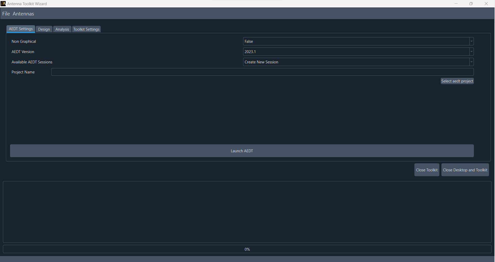
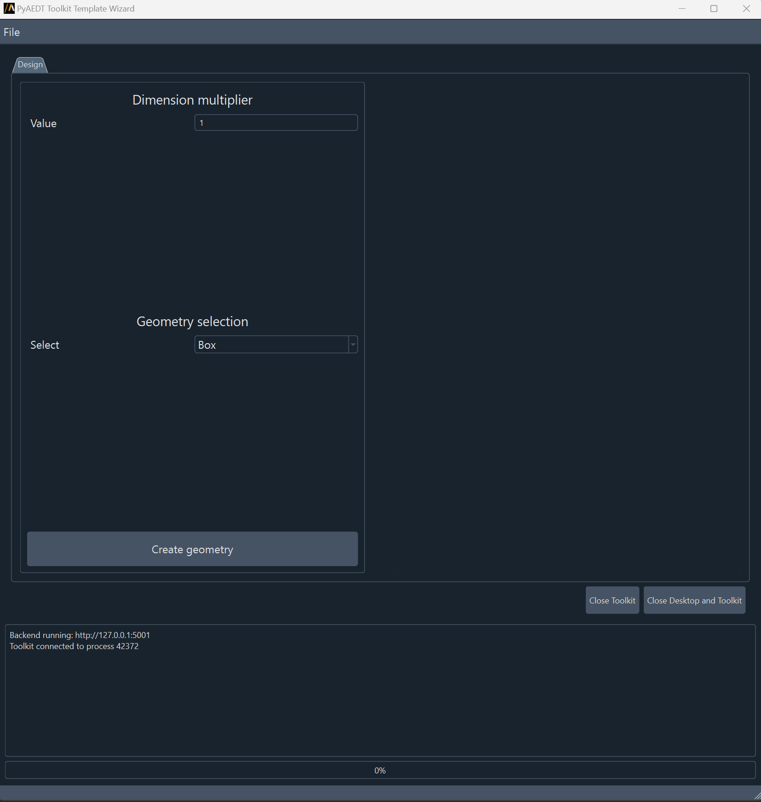

============
UI reference
============

This section describes user interface available in AEDT's **Toolkit Template Wizard**.
To run **Toolkit Template Wizard**, you must have a licensed copy of Ansys Electronics
Desktop (AEDT) installed.

Once **Toolkit Template Wizard** is launched, user can choose settings from first page and connect to an existing
AEDT session or create a new session.

After Electronics Desktop is launched, user can assign a multiplier value which is applied to the dimensions of
the geometry selected in the combo box (box or sphere). The user can push the button **Create geometry** and it
creates the selected geometry with a random position and color.

The user can save the project, File>Save project.

The wizard has a progress bar and a logger box, where the user can see the status of every operation.
Red progress bar means the toolkit is busy, and every operation need to wait until the toolkit is released.
