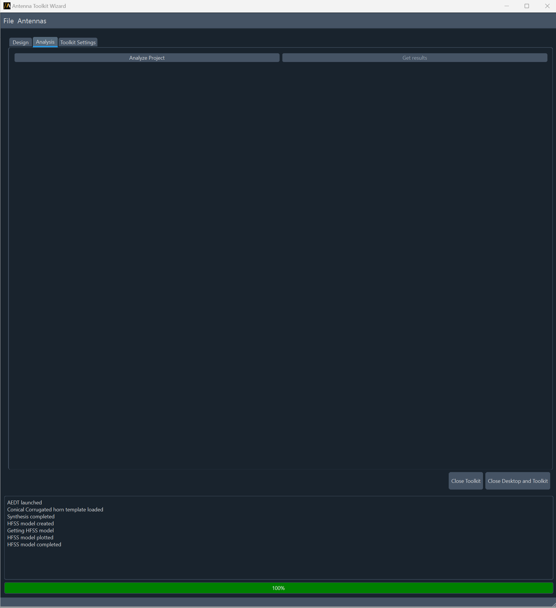
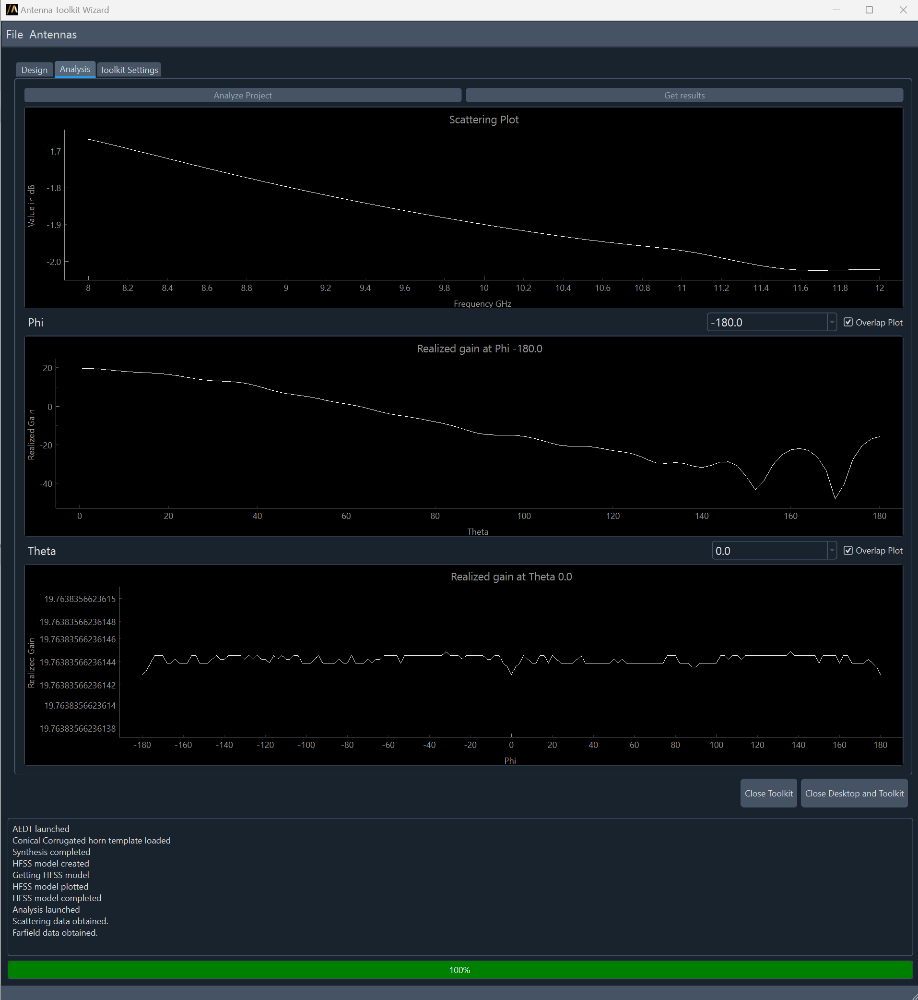

============
UI reference
============

This section describes how to use the Antenna Toolkit Wizard, which requires an
installed and licensed copy of AEDT. It assumes that you have already launched the
wizard from either the AEDT menu or AEDT console. For toolkit installation and wizard
launching information, see these topics:

- :ref:`install-toolkit-AEDT`
- :ref:`install_toolkit_console_ui`

#. On the **AEDT Settings** tab, specify settings for either creating an AEDT session or
   connecting to an existing AEDT session.

   .. note::
      If the Antenna Toolkit Wizard is launched from AEDT, the **AEDT Settings** tab does not appear
      because the toolkit is directly connected to the specific AEDT session.

   .. image:: ../_static/settings.png
      :width: 800
      :alt: Settings tab

   The wizard has a progress bar and a logger box, where you can see the status of every operation.
   A red progress bar means that the toolkit is busy. Every operation must wait until the toolkit is released.

   Once the wizard is connected to AEDT, you want to use the **Antennas** list in AEDT to load an antenna
   template into the wizard's **Design** tab.

   .. image:: ../_static/design_connected.png
      :width: 800
      :alt: Antenna Toolkit Wizard, Design tab

   For example, if you select **Antennas > Horn > Conical Corrugated**, the **Design** tab displays
   the **Synthesis** button and antenna template:

   .. image:: ../_static/corrugated_1.png
      :width: 800
      :alt: Antenna Toolkit Wizard, corrugated synthesis

   In addition to the **Synthesis** button, the **Design** tab displays a **Create Hfss Model** button. This
   button is unavailable if the Antenna Toolkit Wizard is not connected to AEDT.

   - The **Synthesis** button is for performing the synthesis of the antenna. It does not need AEDT.
     You can see the parameters that control the antenna geometry. Additionally, you can do as many
     syntheses as you want and even change the antenna template.

     .. image:: ../_static/corrugated_synthesis.png
        :width: 800
        :alt: Antenna Toolkit Wizard, corrugated synthesis

   - The **Create HFSS Model** button is for creating an HFSS model. It uses the **3D Component**,
     **Create Hfss Setup**, and **Lattice pair** checkboxes along with the **Sweep Bandwidth %** option
     It also uses the **Toolkit Settings** tab:

     .. image:: ../_static/settings_toolkit.png
        :width: 800
        :alt: Toolkit Settings tab

     Descriptions follow for how to use the checkboxes on the **Design** tab:

     - If you select the **3D Component** checkbox, the toolkit creates the antenna and replaces it
       with a 3D component.

     - If you select the **Create Hfss Setup** checkbox, the toolkit automatically creates the boundaries,
       excitations, and ports needed to simulate the antenna. Once you create an HFSS model, you cannot
       create another antenna. Both the **Synthesis** and **Create Hfss Model** buttons become unavailable.
       If you want to create another antenna, you must restart the Antenna Toolkit Wizard.

     - If you select the **Lattice pair** checkbox, the toolkit creates a unit cell assigning a
       lattice pair boundary.

Once you create an antenna, the **Design** tab displays an interactive 3D model rather than
the image of the antenna template:

.. image:: ../_static/antenna.png
   :width: 800
   :alt: Antenna Toolkit Wizard, antenna

If AEDT is launched in graphical mode, you can see the generated model.

In the wizard, you can modify the parameters interactively, watching both the HFSS model and the
interactive 3D plot in the wizard change.

Finally, on the wizard's **Analysis** tab, you have two buttons: **Analyze Project** and **Get results**.
This second button is unavailable until after you analyze the HFSS design.

When you click **Analyze Project**, the project is submitted and then closed. You can see
the job status in the wizard's progress bar or by opening the AEDT Job Monitor.

Once the project is solved, you can click **Get results** on the **Analysis** tab to view results.

To save the project, select **File > Save project**.
